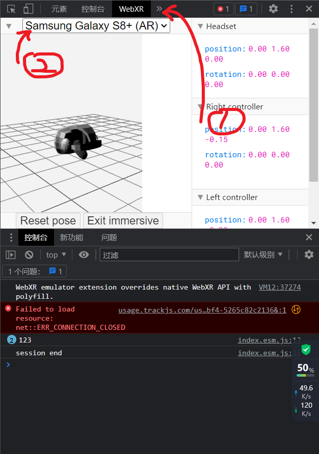

# Chrome测试

1. [WebXR扩展程序下载](https://chrome.google.com/webstore/detail/webxr-api-emulator/mjddjgeghkdijejnciaefnkjmkafnnje?hl=zh-CN) 

2. 然后上https://rabbit224.github.io/test.github.io/   
     
   如图，打开开发者工具栏，找到WebXR一栏，将模拟设备调为S...

3. 
   若一切无误，效果如图，点击按钮进入测试

4. 
   简单的操作指南：

   * 鼠标左键拖拽
     * 手机屏幕内：会切换显示模式（显示操控手机坐标的轴、显示操控手机旋转的轴、不显示）
     * 手机屏幕外：移动模拟视角
   * 右键
     * 手机屏幕内：模拟手指操作
     * 手机屏幕外：移动模拟视角的空间位置
   * 中键
     * 调整模拟视角与手机空间距离的大小，上滑放大，下滑缩小

   想要重置视角要么刷新要么按WebXR栏里面那个Reset pose
